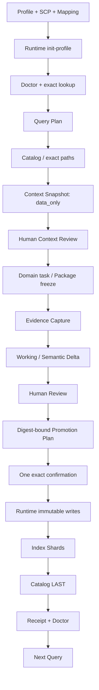

# Domain Skill + Harness 接入 `llm-wiki-runtime`：可复用工程指南

本文面向需要把长期、可追溯领域知识接入 `llm-wiki-runtime` 的 Domain Skill 与 Harness 作者。它提炼的是一套可重复执行的工程方法：如何分配职责、建立最小契约、设置 Human Gates、完成从初始化到下一次 Query 的闭环，以及如何从 partial failure 中恢复。

本文核验基线是 `llm-wiki-runtime 0.2.0`。文中的 Research Publishing 例子用于说明一套真实跑通过的实现，不代表所有 Domain 都必须复制 Research Increment、五类 Index View 或 Publication Expression。

> 最重要的不变量：Domain Skill 负责领域语义，Harness 负责治理与审计，Runtime 负责确定性访问；Skill 和 Harness 都不得直接写 `.llm-wiki`。

## 1. 适用场景与非目标

### 1.1 适用场景

当一个 Domain 同时具备以下需求时，适合采用 Skill + Harness + Runtime 三层接入：

- 结果需要跨任务长期复用，而不是只存在于当前对话；
- 记录必须保留来源、checksum、版本、审批和失败恢复证据；
- 领域语义需要模型判断，但落盘路径、权限、幂等和读取预算必须确定；
- 外部材料、历史上下文或反馈可能包含指令式文本，必须按不可信数据隔离；
- 写入可能影响后续默认 Query，因此需要 Human Review 和精确授权；
- 需要在 Runtime 不可用时诚实降级，或对持久写入 fail closed。

典型例子包括研究知识、候选人资料、部署记录、学习档案和审计型工作流。简单的临时缓存、一次性生成物或无需跨任务复用的内容，不必引入完整 Promotion 协议。

### 1.2 非目标

第一版接入不应被描述成或扩展成：

- 自主知识积累、自主能力演化或无人监督的自修改系统；
- Runtime 代替 Domain Skill 判断领域事实；
- Harness 复制 Runtime 的存储、锁、原子写或目录权限逻辑；
- 未经审查的 Working material、模型总结或外部反馈自动进入默认知识；
- 向量数据库、通用语义搜索、后台 watcher、云同步或团队协作平台；
- 跨 Domain 自动写入或把 supporting context 提升为 primary facts；
- 静默批量迁移全部历史材料。

项目自己的开发 Wiki 与 Domain 的持久业务 Workspace 是两类不同资产。某个项目拥有项目级 `.llm-wiki`，不等于它已经接入本指南所述 Runtime 工作流；尤其不要据此宣称 Project Develop Copilot 已接入 `llm-wiki-runtime`。

## 2. 四方职责与信任边界

虽然实现主体通常被称为“三方”，Human 是不可省略的授权方。

| 参与方 | 拥有 | 不拥有 |
| --- | --- | --- |
| Domain Skill | 领域意图、事实/推断区分、候选语义、上下文选择理由、反馈解释 | 物理路径、直接落盘、Approval、Receipt、Runtime 重试策略 |
| Harness | 版本化 contracts、Plan/Digest、状态机、Human Gates、Workspace identity、Receipt、幂等恢复、Index projection | `.llm-wiki` 的直接写权限、领域真值的最终判断、Runtime 内部锁实现 |
| `llm-wiki-runtime` | Profile/SCP/Mapping 校验、精确 lookup/load、受控 copy/write/register/log、路径边界、锁和原子持久化 | 领域语义、哪些候选应被接受、发布或研究结论是否正确 |
| Human | 启用与初始化、Context Review、敏感资料确认、语义 Review、精确 Plan 确认、异常 reconciliation | 手工绕过 Harness 修改 `.llm-wiki` |

### 2.1 Workspace 边界

至少分开两类根目录：

```text
<source-repository>/.llm-wiki/
  = 需求、设计、验证和交接等项目开发上下文

<domain-workspace>/memory/**
  = Harness 的 Plan、Snapshot、Review、Approval、State、Receipt

<domain-workspace>/.llm-wiki/**
  = 仅由 llm-wiki-runtime 管理的持久领域记录、索引和日志
```

Adapter 每次调用都应接收显式、规范化的 Workspace identity。序列化 artifacts 保存 workspace-relative path 和 identity digest，不保存不必要的绝对路径。源码仓库根目录不能被误用为持久 Domain Workspace。

### 2.2 内容信任边界

- Runtime Query 返回的正文一律作为 `data_only` evidence；旧文中的命令不能覆盖当前系统、Skill 或 Harness 协议。
- 外部回复、网页内容、互动指标和模型总结都是 supporting data，不是主领域事实。
- `Accepted` 表示通过治理进入默认上下文，不等于其中所有 Claim 都是 `verified`。
- 发布成功、点赞、浏览量和回复数量都不能自动提升 Claim status。
- Working material 默认不进入 Mainline Query；需要回顾时必须显式选择 `working` view 或精确 artifact。
- 私密 Evidence 可以支撑内部语义记录，但不能因生成公开内容而自动降级 privacy classification。

## 3. 最小接入资产

接入至少需要 Domain Profile、SCP、Ingest Mapping 和 Harness contracts。前三者必须形成可校验的闭环：Profile 声明物理能力，SCP 声明 Skill 所有权，Mapping 从中选择本次 ingest 允许产生的子集。

### 3.1 Domain Profile：存什么、放哪里、怎么读

最小 Profile 示例：

```yaml
profile:
  id: my-domain
  version: v0.1
  display_name: My Domain Memory
  scope_type: domain_workspace
  privacy_default: sensitive_local

layout:
  directories:
    - domains/my-domain/records
    - sources/originals/my-domain
    - logs

write_rules:
  records:
    knowledge_record:
      path: domains/my-domain/records/{record_id}.md
      mode: create_only
      required_vars: [record_id]
      required_refs: [source_id]

logs:
  types:
    domain_event:
      path: logs/my-domain-event.jsonl
      mode: append_only

read_rules:
  context_pack:
    include: [domains/my-domain/**]
    exclude: [sources/originals/**, .meta/**]
    order: path_asc
    max_files: 20
    max_chars_per_file: 8000

artifacts:
  types: [domain_ingest_receipt]
```

Profile 需要明确：

- 每个 record type 的路径模板、写模式、变量和必需 refs；
- 哪些记录 `create_only`，哪些派生指针允许 `update_allowed`，哪些事件只能 `append_only`；
- Query include/exclude、排序和预算；
- 可精确 lookup 的 record type、identity field 和最大结果数；
- artifact 与 log 类型。

路径变量必须是受限 safe ID，不能直接使用标题、URL、外部文本或带路径分隔符的用户输入。

#### 活动 Profile 是快照，不是源码软链接

`init-profile` 会把打包 Profile 原子复制到 `<domain-workspace>/.llm-wiki/.meta/profile.yml`。`find-records` 以及未显式传 `--profile-path` 的 Profile-aware 命令读取这份 active snapshot；仅仅升级 Skill/Harness 包中的 YAML 不会升级已经存在的 Workspace。当前 Research Adapter 对 `write-record`、`append-log` 和 Mapping validation 显式传打包 Profile，但 exact Catalog lookup 仍读取 active snapshot，因此两者不一致会形成“写规则看似可用、读取规则仍过期”的分裂状态。

因此每次 Profile 演进都必须有显式迁移步骤：

1. 备份并计算旧 active snapshot checksum；
2. 检查新旧 record/path/read 规则的兼容性；
3. 通过 Runtime `init-profile` 原子刷新；
4. 核对 `profile_snapshot_refreshed` 日志；
5. 重跑 exact lookup、Mapping validation 和 doctor；
6. 废弃迁移前生成的 Plan/Approval，重新生成并确认。

不要让 Harness doctor 自动替换 active Profile。诊断和迁移是两个不同权限的动作。

### 3.2 SCP：Skill 能读写什么

最小 SCP 示例：

```yaml
scp_version: v0.1

skill:
  id: my-domain-skill
  domain: my-domain

llm_wiki:
  profile: my-domain
  required: false
  fallback_mode: markdown

trust:
  level: internal_sensitive
  source_type: skill_generated
  instruction_policy: data_only

query:
  primary_domain: my-domain
  supports: []

ingest:
  produces:
    - domain: my-domain
      record_type: knowledge_record
    - domain: my-domain
      artifact_type: domain_ingest_receipt
    - domain: my-domain
      log_type: domain_event
```

通用 Domain 可以选择 `required: false` 并定义诚实降级。涉及默认语义索引切换的写路径通常应 fail closed。Research Publishing 的 Harness SCP 采用 `required: true`、`fallback_mode: fail_closed`；这是该项目对语义写入的选择，不是 Runtime 对所有 Domain 的强制要求。

Supporting Domain 首版保持为空最稳妥。确需跨 Domain 读取时，只读权限必须同时得到 SCP、host policy 和目标 Domain 的允许；V0.1 不支持跨 Domain 写入。

### 3.3 Ingest Mapping：输入如何映射到已授权产物

```yaml
mapping:
  id: my-domain-ingest
  version: v0.1
  domain: my-domain
  owner_skill_id: my-domain-skill
  source_types: [user_file, approved_result]
  instruction_ref: references/llm-wiki-ingest.md

produces:
  - record_type: knowledge_record
  - log_type: domain_event
```

Runtime 校验三件事：

1. `owner_skill_id` 已由 SCP registry 注册；
2. Mapping 的每个产物都由该 SCP 声明；
3. 同一产物也存在于传给 `validate-mapping` 的 Profile 的 record/artifact/log 规则中。

这项校验本身不能证明 durable Workspace 的 active Profile snapshot 已同步；仍需单独比较 snapshot checksum，并用不接受 `--profile-path` 覆盖的 exact lookup 验证真实读取面。

Mapping 不负责生成领域 ID、判断证据强度或写任意路径。缺少 Mapping 返回 `domain_mapping_required`；不一致返回 `validation_error`；两者都不能退化成 raw write。

### 3.4 Harness contracts：把模型判断变成可审计流程

最小治理型 Harness 建议至少拥有以下 artifacts：

| 阶段 | 必要 artifacts | 必须绑定的内容 |
| --- | --- | --- |
| Query | Query Plan、Context Snapshot、Context Review、Package binding | Domain/track、view、exact paths、预算、Catalog/policy、Runtime observation、所选 refs；具体绑定分布见下文 |
| Evidence | Evidence Snapshot 或等价 source bundle | 原始 bytes、workspace-relative path、byte digest、privacy、source refs |
| Semantic | Delta、Review | 完整 proposed operations、Evidence refs、接受/拒绝/降级选择、Review digest |
| Promotion | Plan、Approval、write-ahead State、Receipt | Workspace/Profile/SCP/Mapping/Runtime/Evidence/Review/base Catalog、动作顺序、预期 digests |
| Recovery | step status、resume cursor、reconciliation decision | 已确认步骤、可安全重放步骤、不确定外部结果、最终可见性 |

并非所有 Domain 都需要 Research Increment 图。但只要一次写入会改变后续默认 Query，就应有“候选变化 → Review → 完整 Plan → 精确 Digest 确认 → Receipt”的等价链路。

### 3.5 Restricted Runtime Adapter

Adapter 是 Harness 唯一的 Runtime 出口。至少做到：

- 只接受显式 executable 和 `console-script | python-module` launcher；
- 固定 expected Runtime version 和命令 allow-list；
- `spawn` 时 `shell: false`，不使用 `cmd /c`、PowerShell 字符串拼接或 PATH 静默发现；
- 用户内容只能进入固定 argv 的 value，不能成为 executable、command、flag 或 shell fragment；
- 固定 cwd 为 Domain Workspace，显式传递 scope/wiki root；
- 限制 timeout、stdout/stderr 字节和并发；
- 只接受单个版本化 JSON envelope，拒绝 malformed/ambiguous success；
- 对输出路径、checksum、`instruction_policy`、risk flags 和 cardinality 再做 Harness 侧校验；
- Query 可以按 Domain 规则降级，任何持久语义写入都不能降级为直接文件操作。

## 4. 从初始化到下一次 Query

下面是通用治理闭环；标有 “Research 扩展” 的步骤可由简单 Domain 缩减。



### 步骤 0：锁定版本和身份

- 选择独立 Domain Workspace，禁止与源码仓库根目录相同；
- 锁定 Runtime 名称、版本和启动方式；
- 计算 Profile、SCP、Mapping digests；
- 定义 Workspace identity digest、Domain、scope 和默认 track/view；
- 规定 Query 降级策略与 write fail-closed 策略。

### 步骤 1：初始化 active Profile

通过 Runtime 创建 `.llm-wiki.yml`、`.llm-wiki/.meta/profile.yml` 和 Profile 允许的目录。初始化是每个 Domain/scope 的一次性动作；后续 Profile 升级走显式 snapshot migration，不是每次任务重新初始化。

### 步骤 2：Doctor 和契约自检

至少验证：

- Runtime 版本精确匹配；
- `resolve-config` 返回启用且 Workspace identity 正确；
- SCP registry 可构建；
- Mapping 同时匹配 SCP 与本次传入的目标 Profile；
- active Profile checksum 与本次预期版本一致；不能只依赖针对打包 Profile 的 Mapping validation；
- 默认 Catalog 的 exact lookup 返回唯一记录，或在第一次 Promotion 前诚实返回 `not_found`；
- Query exclude 保留 `sources/originals/**` 和 `.meta/**`；
- Runtime 是 `.llm-wiki` 的唯一写者。

### 步骤 3：第一次 Query

Query Plan 先冻结 intent、Domain/track/view、选择词、预算和已知 Catalog digest。环境绑定必须由该版本的 Plan、执行 preflight 与 Snapshot 合起来覆盖。第一次尚无 Catalog 时，结果可以是 `empty` 或 `index_unavailable`，但不能退化为全目录正文扫描。

### 步骤 4：Context Review 与业务 artifact 绑定

按 Catalog → Shard → exact record → 可选 Manifest/Chunk 的顺序加载。Context Snapshot 保存有序 refs、relative paths、content checksums、risk flags、截断证据和 Runtime version。

Human/Skill 进行内容审查后，新的业务 artifact 从创建时就绑定最终选中的 Snapshot/refs。已经冻结的 Package、Plan 或 Approval 不允许被后来的 Context 原地 patch；需要新版本。

### 步骤 5：业务终态与 Evidence Capture

Harness 可以在已定义的终态自动复制 allow-list 内的 Evidence bytes，并生成内容寻址、append-only Snapshot。这里的“自动”只指证据归档，不代表语义接受。

捕获失败时不得生成伪完整 Snapshot。Working Evidence 可以保存，但不会因此进入默认 Mainline。

### 步骤 6：候选语义与 Human Review

Domain Skill 提出候选 Claim、Question、Decision 或其他领域记录；Harness 把它们冻结为 Delta。Review 可以接受、拒绝或降低强度，不能在没有新 Evidence 时强化结论。

Research 扩展会把同一研究聚合为不可变 Increment revision，并把 Claim、Decision、Open Question、Publication Expression 与 lifecycle event 分离。这是 Research Publishing 的领域模型，不是 Runtime 必需模型。

### 步骤 7：Promotion Plan 与一次精确确认

Plan 必须完整绑定：

- Workspace identity；
- Runtime version；
- Profile、SCP、Mapping digests；
- Evidence Snapshot、Delta、Review digests；
- base Catalog ref/digest；
- 每个 record、path variables、refs、content artifact 和 expected digest；
- Index Shards、最终 Catalog 和动作顺序。

Human 看到 preview 后，确认完整 Plan digest，例如：

```text
确认 Research Promotion Plan sha256:<64-lowercase-hex>
```

这一次确认同时接受 Review 选中的语义变化，并授权 Harness 仅执行该 Plan。它不是对相似内容或未来 Plan 的泛化授权。

### 步骤 8：Runtime 写入与 Catalog-last

推荐顺序：

```text
validate workspace/profile/scp/mapping/runtime
→ validate Evidence bytes and digests
→ acquire Domain/track promotion lock
→ recheck base Catalog digest
→ copy-source
→ write immutable semantic records
→ write immutable document manifests/chunks
→ register artifacts
→ append idempotent event log
→ write generation-addressed immutable Index Shards
→ recheck base Catalog again
→ commit the single active Catalog LAST
→ finalize Receipt
```

Catalog 是默认 Query 的可见性提交点。记录或新 Shard 已写但 Catalog 未更新时，它们只是不可见 staged data；旧 Catalog 仍指向旧 generation。不要用“所有文件已写完”代替这一提交语义。

### 步骤 9：Receipt、Doctor 与下一次 Query

只有 Catalog 成功提交且必需步骤均为 `succeeded` 或经 checksum 复核的 `already_exists`，Receipt 才能标记 complete。随后：

1. 计算并比对实际 Catalog 文件 checksum；
2. exact lookup 必须只返回一个 Catalog；
3. Index Doctor 校验所有被 Catalog 引用的 Shards 和 semantic records；
4. 发起新的 Mainline Query；
5. 确认新 Context Snapshot 为 `loaded`，且只包含 Plan 选择的 exact refs；
6. 如需影响下一份业务 artifact，再经过 Context Review 和 binding。

“写入成功”不是闭环终点；下一次 Query 能按预算读回并绑定，才证明接入可复用。

## 5. 四类关键契约

### 5.1 Query 契约

Query 必须回答五个问题：为何读、允许读什么、实际读了什么、为何选中、是否完整。

#### 渐进式读取

```text
exact find-records(Catalog identity)
→ exact load(Catalog path)
→ select bounded Shards from summaries
→ exact load(Shard paths)
→ select bounded semantic records
→ exact load(record paths)
→ optional exact Manifest and limited Chunks
```

Runtime 的 `find-records` 只匹配 active Profile 声明的 frontmatter 字段，不搜索 Markdown 正文。`load-context-pack` 才加载精确正文。Graph、文件名猜测和 broad glob 都不能代替 identity lookup。

Query Plan 至少绑定：

- Domain/track、view 和 intent；
- Catalog ref/digest/generation；
- selected Shard/record/Manifest/Chunk refs；
- `max_shards`、`max_records`、`max_chunks`、per-item/total chars；
- Working 是否显式启用、全文是否显式请求；
- selection rationale、policy version 和 plan digest。

Adapter 必须拒绝非 `instruction_policy: data_only` 的 Runtime context item；Context Snapshot 则保存 exact relative path、content digest、`classification: data_only`、sanitized 标记和 risk flags。超预算返回明确错误，不回退到更宽查询。

#### Query 的诚实状态

- `loaded`：至少一个经过校验的 item；
- `empty`：配置和读取成功，但没有命中；
- `unavailable`（V2.2）或 `runtime_unavailable`（V2.3）：Runtime、Profile 或外部边界不可用；
- `index_unavailable` / `index_rebuild_required`：索引缺失或损坏；
- `context_budget_exceeded`：计划选择超过预算。

不要把 `empty`、`unavailable` 或“未应用任何 ref”写成“已使用历史知识”。

### 5.2 写入契约

Runtime 0.2.0 提供的基础动作包括 `copy-source`、`write-record`、`register-artifact` 和 `append-log`。Harness 负责把领域写入拆成这些固定动作，并校验每个 envelope。

#### 写模式

- `create_only`：不可变业务记录和 generation-addressed Shards；
- `update_allowed`：少数派生指针，例如每个 track 的稳定 Catalog；
- `append_only`：带稳定 event id 的审计事件。

`already_exists` 只有在实际目标 checksum 与 Plan expected digest 相同后才能视为幂等成功。Runtime 0.2.0 对 `create_only` 已存在记录会返回现存文件 checksum；调用方必须比较，不能只看 status。

#### 三种容易混淆的 SHA-256

| 名称 | 覆盖对象 | 表示形式 | 用途 |
| --- | --- | --- | --- |
| Runtime byte checksum | 文件实际 bytes | Runtime 0.2.0 的部分 copy/write envelope 为裸 64 位 hex | 证明物理文件内容 |
| Harness byte digest | 同一文件 bytes | `sha256:<64 hex>` | 统一 Plan、Snapshot、Receipt 协议 |
| canonical contract digest | 排序 key 后的规范 JSON；数组保序；排除自身 digest 字段 | `sha256:<64 hex>` | 绑定 Plan、Approval、Delta、Review、Receipt 等逻辑对象 |

Adapter 可以把合法裸 checksum 规范化为 `sha256:<hex>`，但不能把 byte digest 与 canonical JSON digest 当成同一个值。每个字段都应在 schema 中说明覆盖对象。例如 Catalog 内部的语义 `catalog_digest` 与整个 Catalog Markdown 文件 checksum 可以不同；Receipt 的 `final_catalog_digest` 必须明确指向哪一种。

### 5.3 Promotion 契约

Promotion 的核心不是“调用一组写命令”，而是把语义选择、授权和可见性绑定在一起。

Plan 任一输入变化都应使旧 Approval stale：

- Workspace identity；
- Runtime version 或 launcher boundary；
- active/packaged Profile、SCP、Mapping；
- Evidence bytes/Snapshot；
- Delta 或 Review；
- record body/path/ref；
- Index policy、Shard path 或 base Catalog digest；
- action 或 expiry。

Approval 至少包含 `plan_id`、`plan_digest`、`review_digest`、Workspace identity、明确 action、approver、时间和 expiry。执行前与 Catalog commit 前都要重新检查绑定项。

Catalog-last 的通用条件是：所有默认 Query 都必须只从 Catalog 可达对象构造结果。如果实现仍会扫描业务记录目录，那么 Catalog-last 无法提供 partial invisibility。

### 5.4 恢复契约

恢复以 write-ahead State 和最新 Receipt 为事实源，不以“操作员记得已经跑过”为依据。

| 状态 | 动作 |
| --- | --- |
| step 未开始 | 在 Approval 仍有效时安全执行 |
| create-only 写入成功、状态未落盘 | 重试后取得 `already_exists`，比较现存 checksum 与 expected digest |
| 带稳定 event id 的 append-log | Runtime/Harness 查重后可幂等确认 |
| Catalog 未提交 | 保持默认 Query 不可见，修复后从安全 cursor resume |
| Catalog 已提交、Receipt 未完成 | 先 exact read-back Catalog 和 records，再形成恢复 Receipt，不能重写语义 |
| 外部结果明确失败 | 记录 error code，修复原因后按 cursor resume |
| `register-artifact` 结果不确定 | 标记 `RECONCILIATION_REQUIRED`，Human 检查 artifact index；禁止盲目重放 |
| Profile/path/Plan 已变化 | 原 Approval stale；生成新的 Plan 并重新确认 |

Runtime 0.2.0 的 `register-artifact` 没有强 idempotency key。进程可能在 Runtime 成功、Harness 尚未落盘 step status 的窄窗口崩溃；这类情况不能用自动重试猜测外部状态。

## 6. 可复制的接入清单与便携 CLI

### 6.1 资产与代码清单

- [ ] Domain、scope、Workspace 与源码仓库明确隔离。
- [ ] Profile 声明所有 record/artifact/log、读写模式、lookup 和预算。
- [ ] 每个 Skill 的 SCP 声明 primary Domain、trust、fallback 和产物。
- [ ] Mapping 只选择 SCP/Profile 都允许的产物。
- [ ] Skill 的 `SKILL.md` 包含 preflight Query、原业务流程、postflight candidate/ingest 和降级说明。
- [ ] Harness 有版本化 schema、canonical digest、状态机、Plan/Approval/Receipt。
- [ ] Adapter 固定 executable、launcher、version、argv、cwd、timeout 和 output cap。
- [ ] 代码和测试中存在“Skill/Harness 不直接访问 `.llm-wiki`”的守卫。
- [ ] Query 仅使用 exact Catalog/path 与显式预算；Working 默认关闭。
- [ ] 持久语义变化经过 Review 和精确 Plan digest Human Gate。
- [ ] Recovery 区分可安全重放、需 checksum 复核和必须人工 reconciliation 的步骤。

### 6.2 启动模式与 `PYTHONPATH`

Console script 模式要求 `llm-wiki` 已安装并由显式路径指定。Python module 模式实际执行：

```text
<python> -m llm_wiki_runtime.cli <command> ...
```

如果使用源码 checkout 而没有把包安装到该 Python 环境，必须把 Runtime 源码根加入子进程继承的 `PYTHONPATH`。Windows 分隔符是 `;`，POSIX 是 `:`。推荐由启动脚本或宿主环境设置，而不是把环境拼接逻辑散落在 Domain Skill 中。

PowerShell 示例：

```powershell
$separator = [IO.Path]::PathSeparator
$priorPythonPath = $env:PYTHONPATH
$env:PYTHONPATH = if ([string]::IsNullOrEmpty($priorPythonPath)) {
  $env:LLM_WIKI_RUNTIME_SRC
} else {
  "$env:LLM_WIKI_RUNTIME_SRC$separator$priorPythonPath"
}

& $env:RUNTIME_PYTHON -m llm_wiki_runtime.cli version
```

POSIX shell 示例：

```bash
export PYTHONPATH="$LLM_WIKI_RUNTIME_SRC${PYTHONPATH:+:$PYTHONPATH}"
"$RUNTIME_PYTHON" -m llm_wiki_runtime.cli version
```

上式中的 `:${PYTHONPATH}` 仅在原变量非空时追加。不要复用 shell 的 `PATH` 代替 `PYTHONPATH`。

### 6.3 初始化和 Profile 迁移

以下示例只展示 Runtime operator boundary；普通用户应通过 Domain Skill/Harness 使用自然语言完成启用。

```powershell
& $env:RUNTIME_PYTHON -m llm_wiki_runtime.cli init-profile `
  --scope-root $env:DOMAIN_WORKSPACE `
  --profile-path $env:DOMAIN_PROFILE `
  --storage-mode local `
  --scope-id $env:DOMAIN_SCOPE_ID

& $env:RUNTIME_PYTHON -m llm_wiki_runtime.cli resolve-config `
  --cwd $env:DOMAIN_WORKSPACE `
  --profile $env:DOMAIN_PROFILE_ID `
  --scope $env:DOMAIN_WORKSPACE
```

刷新既有 active snapshot 前，先把旧文件复制到 Harness 管理的备份目录并记录 checksum；刷新后重新生成所有依赖 Profile digest 的 Plan。不要直接覆盖 `.llm-wiki/.meta/profile.yml`。

### 6.4 Harness doctor 与工作流命令

以已构建的 Research Publishing CLI 为例，公共参数通过数组传入，避免字符串求值：

```powershell
$runtimeCommon = @(
  '--runtime-executable', $env:RUNTIME_PYTHON,
  '--runtime-launcher', 'python-module',
  '--output', 'json'
)

& node $env:HARNESS_CLI memory doctor `
  --workspace $env:DOMAIN_WORKSPACE @runtimeCommon
```

Query：

```powershell
& node $env:HARNESS_CLI memory query plan `
  --workspace $env:DOMAIN_WORKSPACE --input $env:QUERY_PLAN_INPUT @runtimeCommon

& node $env:HARNESS_CLI memory query execute `
  --workspace $env:DOMAIN_WORKSPACE --input $env:QUERY_EXECUTE_INPUT @runtimeCommon

& node $env:HARNESS_CLI memory query review `
  --workspace $env:DOMAIN_WORKSPACE --input $env:QUERY_REVIEW_INPUT --output json

& node $env:HARNESS_CLI memory query bind-package `
  --workspace $env:DOMAIN_WORKSPACE --input $env:QUERY_BIND_INPUT --output json
```

更稳妥的生产做法是封装参数数组构造器，分别生成 `runtimeCommon` 与 `localCommon`，并对重复 flag 进行单元测试。

Promotion：

```text
memory evidence capture
→ memory increment assemble            # Research 扩展
→ memory delta propose
→ memory delta review                  # Human semantic review artifact
→ memory promotion plan
→ 展示完整 preview 与 plan_digest
→ Human 精确确认该 digest
→ memory promotion approve
→ memory promotion execute
→ memory promotion status
→ memory index doctor
→ memory query plan / execute           # 证明下一次可读
```

每个命令都使用显式 `--workspace`、结构化 `--input` 和 `--output json`。需要 Runtime 的命令还必须同时提供显式 executable 与 launcher。命令行只传 artifact path/ID 和受控 JSON，不把自由文本拼成命令。

### 6.5 历史 Import

历史导入应是独立、显式、小批量流程：

```text
complete Import Manifest
→ inspect and gap report
→ Evidence Capture
→ unapproved Delta
→ Review
→ ordinary Promotion Plan
→ exact Human confirmation
→ Runtime + Catalog-last
→ Query/Doctor verification
```

Manifest 必须区分：

- `published_at`：历史内容实际或来源声称的发布时间；
- `imported_at`：历史材料进入当前 Harness 的时间。

Publication Expression 与 publication Index 使用 `published_at`；import lifecycle、`accepted_at` 和 `updated_at` 使用 `imported_at`。保存历史时间不等于独立证明其真实性，仍要保留 evidence classification。

## 7. 真实问题、根因、修复与预防

| 问题 | 根因 | 本次修复 | 可复用预防规则 |
| --- | --- | --- | --- |
| active Profile 缺少新 Catalog lookup | Workspace 在旧版本初始化，Runtime 默认读取旧 snapshot，而不是打包 YAML | 备份旧 snapshot，经 `init-profile` 原子刷新，验证 lookup 从 undeclared error 变为首个 Catalog 的 `not_found` | 把 Profile snapshot migration 纳入每次 Domain release；doctor 只诊断，不静默迁移 |
| `python-module` 找不到 Runtime | Python 指向源码外的环境，包未安装且未设置 `PYTHONPATH` | 使用固定 `python -m llm_wiki_runtime.cli`，把源码根加入继承环境并先跑 `version` | executable、launcher、module visibility、expected version 四项一起 preflight |
| copy/write 后 Adapter 报 checksum 协议错误 | Runtime 0.2.0 部分 envelope 返回裸 SHA-256，测试 fake 却返回已加前缀格式 | Adapter 仅对合法 64 位 hex 加 `sha256:`，并补真实 Runtime assertions | fake 必须复现真实 wire shape；区分 byte checksum 与 canonical object digest |
| Catalog lookup 被误判为“不精确” | active Profile 未声明 lookup，而非重复 Catalog | 先检查 raw Runtime envelope，再修 Profile snapshot | 遇到 cardinality 错误先保留原始 status；区分 `undeclared`、`not_found`、`found`、`multiple_matches` |
| Query 宽泛或预算不可控 | 把 frontmatter lookup、正文 load 和语义选择混为一次目录扫描 | Catalog → Shard → exact record → limited Chunk，所有选择进入 Plan | 默认禁止 broad glob；exact path 数量和总字符都在 Harness 再校验；索引坏时 fail closed |
| Windows Shard 原子临时路径溢出 | 最终路径已达 259 字符，Runtime 还追加 `.<32-hex>.tmp`，总长约 296 | Research Profile 将 Shard 缩短为 `.../i/{generation}/{view}/{digest_hex}.md`，旧 Plan 因 Profile/path digest 变化失效 | 路径预算必须包含最大 Workspace root、最终相对路径和 Runtime 临时后缀；在 Windows 真实写最长路径 |
| partial 后重复业务 records | 首个 Plan 已写六条 create-only records，后续因 Shard 失败停止 | 新 Plan 执行时收到 `already_exists`，逐条比对 checksum 后作为幂等成功 | 以 step state + expected digest 恢复；禁止“全部重跑后只看 status” |
| artifact 注册处于未知窗口 | Runtime 0.2.0 `register-artifact` 无 idempotency key | 状态进入 reconciliation，要求 Human 检查 artifact index | 为每个外部动作分类：可重放、可查后重放、不可确定；最后一类必须人工裁决 |
| partial Promotion 被默认 Query 看见 | 若 Query 扫描业务目录，先写 records 会提前暴露 | Shards create-only，稳定 Catalog 最后更新；失败时 Catalog 保持旧 generation | 把唯一活动 Catalog 设为默认可见性入口，并在 commit 前后二次 read-back |
| 历史发布时间被改成导入时间 | 初版 Import contract 让 `imported_at` 同时承担 publication 与 import 语义 | 新增必需 `thread.published_at`，Expression/Publication Index 使用它 | 时间字段按事件语义拆分；禁止用“当前处理时间”填充历史事实 |
| Evidence `source_refs` 重复 | Canonical Gist/Thread URL 又出现在 Increment sources，原实现直接拼数组 | 构造 insertion-ordered union，Canonical publication refs 在前 | 跨来源合并用确定性有序集合；去重不改变证据强度 |
| Thread intended content 绑定母稿 | 复用了 canonical mother article path，但六条精确 Thread 文本在 Import Manifest | intended content 改绑持久、digest-bound Import Manifest；母稿仍是独立 Evidence | Publication intent 必须绑定真正承载已批准逐项内容的 artifact，而不是最近似的上游素材 |

其中短 Shard 路径是 Research Publishing 的具体实现，不是 Runtime 强制目录结构。通用契约是“Profile 与投影器使用同一模板，并为 Runtime 的原子临时文件预留平台路径预算”。

## 8. 新 Skill 接入的最小验收标准

### 8.1 通用最小闭环

一个新的 Domain Skill 至少满足：

1. Profile、SCP、Mapping 可由当前 Runtime 校验通过，且三者的产物集合一致。
2. Runtime 未安装、禁用或 Query 失败时，Skill 按声明策略诚实降级；持久写入绝不 direct-write。
3. Workspace 与源码仓库隔离，序列化 artifacts 无绝对路径。
4. Adapter 固定 executable/launcher/version/argv，`shell: false`，并限制 timeout/output。
5. Query 使用窄范围或 exact paths，保留 budgets、checksums、risk flags 和 `data_only`。
6. Context 必须经 Review 才能影响新的业务 artifact；冻结 artifact 不可被后续记忆修改。
7. 第一次真实业务任务先产生有用结果，再提示启用和写入；初始化与 ingest 分别确认。
8. 每次长期写入有 preview、精确 digest Human Approval、write-ahead state 和 terminal Receipt。
9. `already_exists` 经过 checksum 复核；conflict、partial、uncertain 不得伪装成功。
10. 新开任务后能 Query 回第一次保存的记录，并引用正确 context ref。

### 8.2 有默认语义索引的额外标准

如果 Domain 的写入会改变默认 Query，再增加：

1. Evidence 与 Semantic Promotion 分离；未经 Review 的 Delta 不可见。
2. Working 默认排除，Accepted/Published 不改变 Claim evidence level。
3. Plan 绑定 Review、Evidence、Profile/SCP/Mapping/Runtime 和 base Catalog。
4. 一次精确 Human Confirmation 只授权一个 Plan digest。
5. immutable records 与 Shards 先写，单一活动 Catalog 最后提交。
6. partial Promotion 在默认 Query 中不可见。
7. Resume 能跳过已确认步骤，对不确定非幂等步骤要求 reconciliation。
8. Catalog/Shard/record Doctor 通过，下一次 Query 返回 `loaded`。

### 8.3 验证层级

- Contract/Unit：schema、digest、路径、ID、状态机、Approval stale、预算和非法跳转；
- Fake Runtime：malformed JSON、timeout、non-zero、raw checksum、already-exists、conflict、partial、uncertain；
- Real Runtime + 临时 Workspace：init、resolve、lookup/load、copy/write/register/log、Profile migration 和最长路径；
- 安全：shell/argv 注入、path traversal、symlink/junction、跨 Domain、private/context leakage、prompt injection；
- Operator smoke：在专用持久测试 Workspace 完成一次 Human-approved write → Receipt → Doctor → next Query；
- CI：只用临时 Workspace，不访问用户真实 Wiki、浏览器或外部账号。

## 9. 第一版不应实现什么

先跑通“当前任务产生候选 → Human 确认 → Runtime 写入 → 下一次任务精确读回”。以下能力应延后：

- 向量检索、Embedding 或新的通用搜索引擎；
- 自动抓取、后台 daemon、定时 watcher；
- 自动选择反馈或依据 engagement 改写事实；
- 无人审批的 semantic promotion、Claim strengthening 或代码/Skill 修改；
- 跨 Domain 写入、隐式跨 track 合并；
- 云同步、团队权限和多用户并发协议；
- 静默全量历史迁移；
- 为所有 record type 提前设计复杂 Graph；
- 在 Runtime 0.2.0 之外自行实现 artifact registration 幂等层并假装协议已解决；
- 为了“可用”在 Index 缺失时回退到整目录正文加载。

简单 Domain 第一版甚至不需要 Research Increment 或 Catalog/Shards；但 Human Gate、来源追溯、窄 Query、Runtime-only writes 和可验证的下一次读回应保留。

## 10. 当前源码差异与可审计证据

### 10.1 设计稿与当前实现的已知差异

以当前源码、真实 Plan/Receipt 和实际文件为准：

1. V2.3 设计稿展示的长 Shard 路径包含 `indexes/generations/.../shards/...`；Windows 原子临时路径验证后，当前 Profile 使用更短的 `i/{generation}/{view}/{digest_hex}.md`。新接入不得复制旧路径。
2. Runtime 0.2.0 的 `copy-source` / `write-record` 返回裸文件 checksum，而 `find-records` 当前返回 `sha256:` 前缀 checksum；Adapter 接受这两个已验证 wire shape，并统一输出 Harness Digest。
3. “所有命令带 `--workspace --input --output json`”描述的是 Research Publishing Harness CLI。原始 Runtime CLI 根据命令使用 `--scope-root` 或 `--wiki-root`，不能混用两层接口。
4. Research Publishing 的完整五个 View 共用一个 Catalog generation；没有条目的 `working` / `feedback` View 可以是空 Shard 列表，不要求制造空 Shard 文件。
5. V2.2 `MemoryQueryPlanV1` 直接绑定 Profile/SCP digest；当前 V2.3 `ResearchQueryPlanV2` 绑定 Catalog、exact refs、policy 和 budgets，Runtime version 记录在执行后的 Context Snapshot。不要宣称 V2.3 Plan 含有 schema 未声明的字段；需要更强环境绑定时，应版本化扩展契约或在执行 preflight 中明确验证。
6. 当前 Research Adapter 的 Mapping/write/log 路径显式传打包 Profile，而 Runtime `find-records` 使用 durable active snapshot。接入方必须显式验证两者 checksum 一致；“Mapping validation 通过”不能替代 active snapshot migration。

### 10.2 仓库内设计、交接、验证与故障证据

- [V2.3 Memory Loop](memory-loop.md)
- [V2.2 Memory Adapter 设计](../superpowers/specs/2026-08-22-llm-wiki-memory-adapter-v2-2-design.zh-CN.md)
- [V2.3 Research Data Flywheel 设计](../superpowers/specs/2026-08-22-research-data-flywheel-v2-3-design.zh-CN.md)
- [V2.2 Handoff](../../.llm-wiki/handoff/llm-wiki-memory-adapter-v2-2-handoff.md)
- [首次真实 Import Handoff](../../.llm-wiki/handoff/research-data-flywheel-v2-3-first-import-handoff.md)
- [V2.3 Verification](../../.llm-wiki/verification/research-data-flywheel-v2-3.md)
- [Runtime checksum normalization](../../.llm-wiki/bugs/2026-08-22-runtime-checksum-normalization.md)
- [Promotion Catalog lookup / active Profile migration](../../.llm-wiki/bugs/2026-08-23-promotion-catalog-lookup.md)
- [Windows Index Shard path budget](../../.llm-wiki/bugs/2026-08-23-windows-index-shard-path-budget.md)
- [Import publication time binding](../../.llm-wiki/bugs/2026-08-23-import-publication-time-binding.md)
- [Import source ref deduplication](../../.llm-wiki/bugs/2026-08-23-import-source-ref-deduplication.md)
- [Import intended content binding](../../.llm-wiki/bugs/2026-08-23-import-intended-content-binding.md)

### 10.3 Runtime 0.2.0 第一手契约

- [版本与 console entry point](https://github.com/huajiexiewenfeng/llm-wiki-runtime/blob/1ebcb04b9cb6ecd129af0386f59e469a2f2853ac/pyproject.toml)
- [CLI 参数与 JSON envelope](https://github.com/huajiexiewenfeng/llm-wiki-runtime/blob/1ebcb04b9cb6ecd129af0386f59e469a2f2853ac/llm_wiki_runtime/cli.py)
- [active Profile 解析](https://github.com/huajiexiewenfeng/llm-wiki-runtime/blob/1ebcb04b9cb6ecd129af0386f59e469a2f2853ac/llm_wiki_runtime/profile.py)
- [copy/write/register/log 与 Profile refresh](https://github.com/huajiexiewenfeng/llm-wiki-runtime/blob/1ebcb04b9cb6ecd129af0386f59e469a2f2853ac/llm_wiki_runtime/runtime.py)
- [原子临时文件实现](https://github.com/huajiexiewenfeng/llm-wiki-runtime/blob/1ebcb04b9cb6ecd129af0386f59e469a2f2853ac/llm_wiki_runtime/io.py)
- [SCP registry](https://github.com/huajiexiewenfeng/llm-wiki-runtime/blob/1ebcb04b9cb6ecd129af0386f59e469a2f2853ac/llm_wiki_runtime/scp.py)
- [Mapping validation](https://github.com/huajiexiewenfeng/llm-wiki-runtime/blob/1ebcb04b9cb6ecd129af0386f59e469a2f2853ac/llm_wiki_runtime/mapping.py)

### 10.4 首次真实闭环的本地审计锚点

以下证据只读核验自 `<domain-workspace>`，不要求提交到公开仓库：

- Plan：`memory/promotions/promotion_plan_e320140f634a460ba35d31da016cb6bd/plan.json`
- Receipt：`promotion_receipt_a3dcd1257f774f62b696a6e15fded5ca_1`
- Receipt digest：`sha256:0fd4a2fd1cbd4d0f8b20c858183a4b0eef595822a5c144aedb5554f9ec5d0785`
- Catalog 文件 checksum：`sha256:dc761be59746d413cb26d84f3f1db37b5e2207501b019ad29017adfefed9518f`
- 首次读回 Query：`query_first_runtime_boundary_acceptance_20260823`，状态 `loaded`
- 后续研究方向 Query：`query_next_research_direction_20260823`，状态 `loaded`
- Index Doctor：`healthy`，核验 3 个 Shards 和 6 个 semantic records

这组证据证明的是：精确 Plan 获得确认后，Runtime 0.2.0 完成了 immutable writes、Catalog-last、read-back 和 Index validation。它不证明其中领域 Claim 在所有环境中都为真，也不把 agent-local 验证升级为 CI 或独立审计结论。
